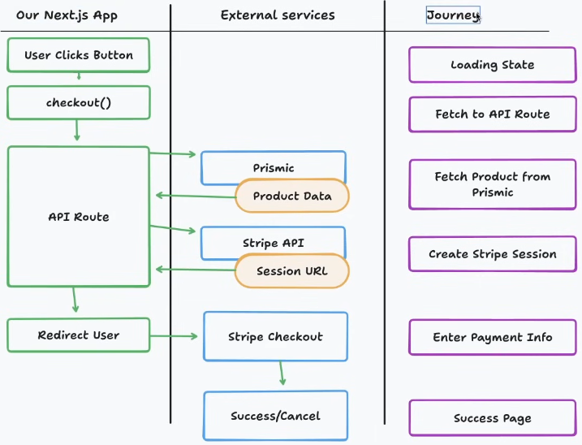

# Nimbus 27 - 3D Ecommerce Keyboard Website

This project is a modern, interactive ecommerce website for custom mechanical keyboards ("Nimbus 27"). It was built following the YouTube tutorial **"Build an Ecommerce Keyboard Website with Three.js, Next.js, GSAP, and Prismic"**.

The application showcases high-performance 3D product rendering, smooth animations, and a headless CMS integration for content management, culminating in a secure checkout process via Stripe.

## 🛠️ Tech Stack

This project leverages a modern web development stack:

-   **Framework**: [Next.js 15+](https://nextjs.org/) (App Router)
-   **3D Rendering**: [Three.js](https://threejs.org/), [React Three Fiber](https://docs.pmnd.rs/react-three-fiber), and [Drei](https://github.com/pmndrs/drei)
-   **Animations**: [GSAP](https://gsap.com/) (GreenSock Animation Platform)
-   **CMS**: [Prismic](https://prismic.io/) (Headless CMS for product data and page content)
-   **Styling**: [Tailwind CSS](https://tailwindcss.com/)
-   **Payments**: [Stripe](https://stripe.com/)

## 🚀 Key Learnings

Throughout the development of this project, I gained experience in:

1.  **3D Web Integration**: Loading and manipulating GLTF 3D models within a React application using React Three Fiber.
2.  **Advanced Animations**: Orchestrating complex entry animations and scroll-triggered effects using GSAP.
3.  **Headless CMS Architecture**: Modeling content slices in Prismic and dynamically rendering them in Next.js.
4.  **Server-Side Logic**: Implementing secure API routes in Next.js to handle payment processing.

## 💳 Stripe Integration & Data Flow

One of the most critical features implemented is the secure payment flow. We do not trust the client-side with price data. Instead, we verify product details directly from our CMS (Prismic) before initiating a transaction with Stripe.

### The Checkout Flow



As illustrated in the diagram above, the checkout process follows a strict security pattern:

1.  **User Action**: The user clicks the "Buy Now" button on the frontend.
2.  **API Call**: A request is sent to our internal Next.js API route (`/api/checkout`).
3.  **Verification**: The API route acts as a secure intermediary. It fetches the authoritative product data (specifically the **price** and **metadata**) directly from **Prismic**. This prevents malicious users from manipulating the price on the client side.
4.  **Session Creation**: With the verified data, the API creates a **Stripe Checkout Session**.
5.  **Redirect**: Stripe returns a session URL, and our app redirects the user to the secure Stripe payment page.
6.  **Completion**: Upon successful payment, the user is redirected back to our Success page.

## 📦 Getting Started

First, install the dependencies:

```bash
npm install
```

Run the development server:

```bash
npm run dev
```

Open [http://localhost:3000](http://localhost:3000) with your browser to see the result.

To edit content models or slices, run the Slice Machine:

```bash
npm run slicemachine
```